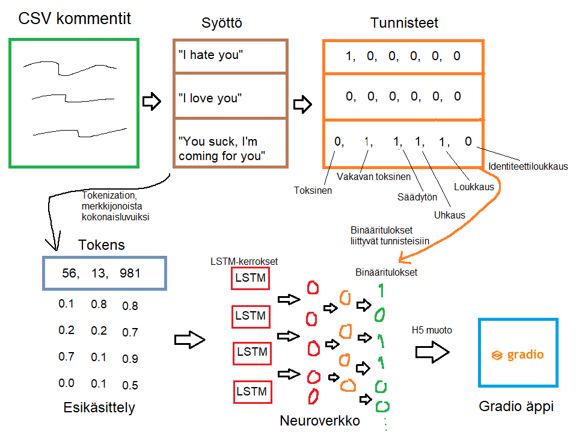

## Tarvittavat Python-kirjastot

Tensorflow, pandas, matplotlib sekä scikit-learn

## Projektin data

Projektin data tulee Kaggle-palvelusta [Comment toxicity -haasteesta](https://www.kaggle.com/competitions/jigsaw-toxic-comment-classification-challenge/overview).

Havainnollistava kuva miten projekti malli toimii:

